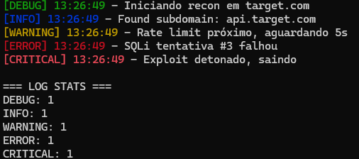

# 🔍 Logger.c - Biblioteca de Logging Leve para C

Sistema de logging simples e colorido para projetos em C. Desenvolvido para ferramentas.

## ✨ Funcionalidades

- 5 níveis de log (DEBUG, INFO, WARNING, ERROR, CRITICAL)
- Saída colorida no terminal
- Suporte para arquivo de log
- Logging simultâneo (console + arquivo)
- Dispatch baseado em ponteiros de função
- Dependências mínimas

## 🚀 Início Rápido
```c
#include "logger.h"

int main(void) {
    logger_init("recon.log");
    
    logger(INFO, "Iniciando recon em target.com");
    logger(WARNING, "Rate limit próximo");
    logger(ERROR, "Tentativa de SQLi falhou");
    
    logger_print_stats();
    logger_close();
    return 0;
}
```

## 📸 Demonstração

| Terminal mostrando logs coloridos |
|               :---:               |
|               <br>                |
|               |


## ⚙️ Configuração
```c
// Controle de saídas
logger_set_console(true);    // Habilita/desabilita saída no console
logger_set_file(true);        // Habilita/desabilita saída em arquivo

// Desabilitar cores (útil para redirecionamentos)
logger_disable_colors();

// Ambos habilitados ao mesmo tempo
logger_init("exploit.log");
logger_set_console(true);     // Logs aparecem no terminal
logger_set_file(true);         // E também são salvos no arquivo
```

## 🛠️ Compilação
```bash
# Compilação básica
gcc -o programa main.c logger.c

# Com warnings (recomendado)
gcc -Wall -Wextra -o programa main.c logger.c

# Debug
gcc -g -Wall -Wextra -o programa main.c logger.c
```

## 📚 Referência da API

### Inicialização
```c
void logger_init(const char *filename)  // Inicializa logger com arquivo
void logger_close(void)                 // Fecha arquivo e limpa recursos
```

### Logging
```c
void logger(enum Level_Type type, char* message)

// Níveis disponíveis:
DEBUG     // Verde   - Informações detalhadas de debug
INFO      // Azul    - Informações gerais
WARNING   // Amarelo - Avisos
ERROR     // Vermelho - Erros
CRITICAL  // Vermelho Intenso - Erros críticos
```

### Configuração
```c
void logger_set_console(bool enable)    // Controla output no terminal
void logger_set_file(bool enable)       // Controla output em arquivo
void logger_disable_colors()            // Remove cores ANSI
```

### Estatísticas
```c
void logger_print_stats()  // Exibe contador de mensagens por nível
```

## 🎯 Casos de Uso

### Bug Bounty / Pentest
```c
logger_init("recon_target.log");

logger(INFO, "Subdomain enumeration started");
logger(DEBUG, "Testing: dev.target.com");
logger(WARNING, "WAF detected on admin.target.com");
logger(ERROR, "Connection timeout on api.target.com");
```

### Desenvolvimento
```c
logger_init("debug.log");
logger_set_file(false);  // Só console durante dev

logger(DEBUG, "Entering function: process_payload()");
logger(INFO, "Buffer allocated: 1024 bytes");
```

## 🧠 Detalhes Técnicos

- **Function Pointers:** Sistema de dispatch dinâmico usando array de ponteiros
- **Cores ANSI:** Códigos de escape para terminal colorido
- **File I/O:** `fflush()` automático após cada escrita
- **Error Handling:** Degradação graceful se abertura de arquivo falhar
- **Thread-Safety:** ⚠️ Não thread-safe (usa buffer estático para timestamp)

## 📖 Estrutura do Código
```
logger/
├── logger.h      # Interface pública (declarações)
├── logger.c      # Implementação
├── main.c        # Exemplo de uso
└── README.md     # Documentação
```

## 🔧 Limitações Conhecidas

- Não thread-safe (buffer estático em `current_time()`)
- Cores ANSI podem não funcionar em Windows CMD (use WSL/PowerShell)
- Mensagens de log não aceitam formatação estilo `printf()` (ver roadmap)

## 🚀 Roadmap

- [x] Níveis de log coloridos
- [x] Output em arquivo
- [x] Logging dual (console + arquivo)
- [x] Estatísticas de uso
- [ ] Formatação variadic (estilo `printf`)
- [ ] Rotação de logs
- [ ] Thread-safety
- [ ] Header-only version

## 🎓 Aprendizado

Este projeto foi desenvolvido como parte do meu roadmap de estudos em:
- Ponteiros de função em C
- Operações de File I/O
- Padrões de error handling
- Design modular em C

**Objetivo:** Fundamentos em C.

## 📝 Exemplo Completo
```c
#include "logger.h"

int main(void) {
    // Inicializa logger com arquivo
    logger_init("pentest.log");
    
    // Configura: console + arquivo simultâneos
    logger_set_console(true);
    logger_set_file(true);
    
    // Simula sessão de pentest
    logger(INFO, "=== PENTEST SESSION START ===");
    logger(DEBUG, "Target: https://example.com");
    logger(INFO, "Running subdomain enumeration...");
    logger(WARNING, "Found deprecated API endpoint");
    logger(ERROR, "Auth bypass attempt failed (WAF)");
    logger(CRITICAL, "XSS vulnerability confirmed!");
    logger(INFO, "=== PENTEST SESSION END ===");
    
    // Exibe estatísticas
    logger_print_stats();
    
    // Cleanup
    logger_close();
    
    return 0;
}
```

## 📄 Licença

MIT License - Livre para usar, modificar e distribuir.

## 🤝 Contribuições

Este é um projeto de aprendizado pessoal, mas sugestões são bem-vindas!

---

**Desenvolvido por Johnny** | [GitHub](https://github.com/JohnnyKelvyn)